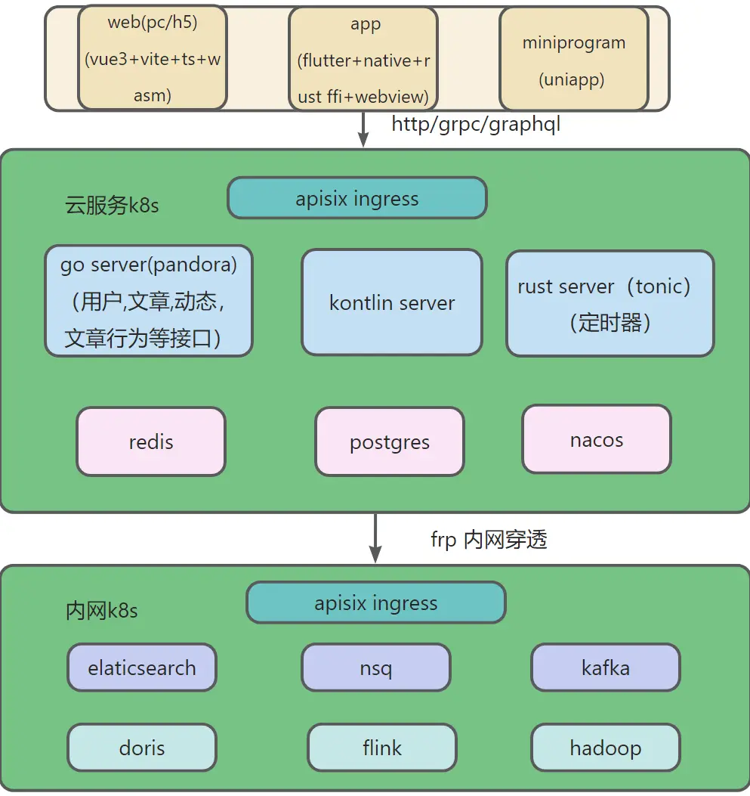

# hoper

# _lang
go kotlin rust ts lua(openresty) python的语法学习,总结的坑和黑魔法,刷LeetCode的解答

# build
开发及部署需要的操作总结脚本汇总，开发过程中遇到的坑总结
- **config:** nginx/ rust cargo/ gradle的配置
- **env:**
  - dev: 开发所需工具的安装步骤，及安装过程中的问题解决方法，及使用方法
  - shell: 开发所需脚本
- **k8s:** 各种工具部署的k8s 配置
  - app: 个人项目配置drone所需的Dockerfile，k8s配置文件模板、脚本
  - tools: k8s环境中所需工具的安装方法，helm & yaml config,及使用方法
  - tpl: k8s配置模板
# client
## desktop
flutter desktop尝鲜
## app
 hoper的移动端
flutter开发，Getx状态管理，组件化开发
开发了闪屏页，登录注册功能，动态列表，动态详情，发布照片动态，点赞评论等
grpc调用服务端接口
尝试了简单的dart ffi，调用go，rust交叉编译的动态库，webview嵌入，启动本地服务存储加载页面实现页面热更新
集成sqlite,hive键值对存储

## web
主要是hoper的h5版本，整合vue3+vite+typescript+wasm，实现一套环境开发pc和h5 web，开发了登录注册功能，动态列表，动态详情，发布动态，点赞收藏评论等

## uniapp
uniapp+vue3 开发的hoper小程序，编译的h5版本将取代h5版本

# proto
hoper项目客户端，服务端通用的proto定义，用来生成go，rust，java，dart，js grpc源文件

#### utils
各种工具类
## kotlin
### protobuf
protoc生成的源码单独成一个模块
### quarkus
quarkus框架
### user
- spring+vertx
- spring+grpc
## rust
 基于tonic的grpc
## 架构设想
istio+k8s

免责申明
1、本项目仅供个人学习交流使用。
2、本工具仅供学习交流使用，请勿用于非法和商业用途。